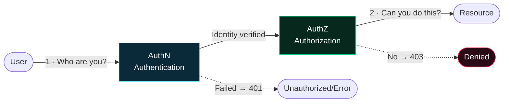
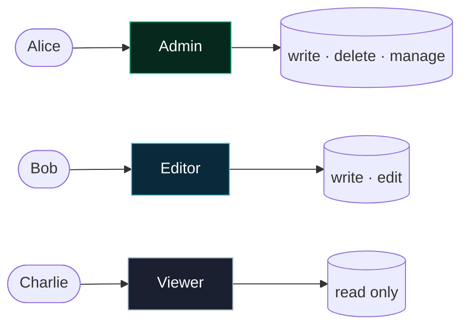
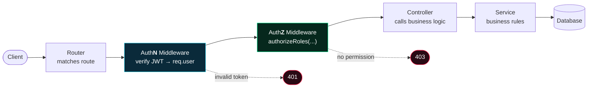

<div class="absolute inset-0 flex flex-col items-center justify-center">


# <span class="glitch">AUTHORIZATION</span>

<div class="text-2xl text-cyan font-mono mt-2 tracking-widest">A U T H O R I Z A T I O N</div>

<div class="scanbar my-8 w-2/3 mx-auto" />


<div class="mt-10 flex items-center justify-center gap-3 text-sm text-gray-500 font-mono">
  <span class="i-carbon:circle-solid text-neon text-[8px] animate-ping" />
Not just a piece of code — the <strong>most critical line of defense</strong> an engineer must build in a system's architecture.
</div>

</div>


<!--
Welcome. Today we will talk about the most neglected but most costly topic in the software world: Authorization.
Throughout this presentation, we will see not only the theory, but also real-world, billion-dollar incidents.
-->


---
layout: two-cols
layoutClass: gap-12
transition: slide-up
---

# Agenda

<div class="text-sm text-gray-400 mb-4">Introduction → Problem → Architecture → Real Life → Conclusion</div>

<div class="space-y-3 mt-10">
  <div class="flex items-center gap-3">
    <span class="w-8 h-8 flex items-center justify-center rounded bg-cyan/10 text-cyan font-mono text-xs">01</span>
    <span class="font-medium">Core Concepts</span>
  </div>
  <div class="flex items-center gap-3">
    <span class="w-8 h-8 flex items-center justify-center rounded bg-neon/10 text-neon font-mono text-xs">02</span>
    <span class="font-medium">AuthZ Models</span>
  </div>
  <div class="flex items-center gap-3">
    <span class="w-8 h-8 flex items-center justify-center rounded bg-purple/10 text-purple font-mono text-xs">03</span>
    <span class="font-medium">Standards & Architecture</span>
  </div>
  <div class="flex items-center gap-3">
    <span class="w-8 h-8 flex items-center justify-center rounded bg-amber/10 text-amber font-mono text-xs">04</span>
    <span class="font-medium">Code Implementations</span>
  </div>
  <div class="flex items-center gap-3">
    <span class="w-8 h-8 flex items-center justify-center rounded bg-hot/10 text-hot font-mono text-xs">05</span>
    <span class="font-medium">Case Studies</span>
  </div>
</div>

::right::

<div class="mt-20 space-y-3">

<NeonCard icon="i-carbon:idea" title="Key Message" variant="neon">
Authentication is "Who are you?". Authorization is "What can you do?" — and <strong>it exists solely for security.</strong>
</NeonCard>

<NeonCard icon="i-carbon:warning-alt" title="Why is it important?" variant="hot">
OWASP Top 10 <strong>#1</strong> vulnerability: <em>Broken Access Control</em>. Automated tools cannot find it — because it is a <strong>logical flaw.</strong>
</NeonCard>

</div>

<!--
Our journey today: starting from basic concepts, moving to models, protocols, architecture, actual code, and finally to real-world incidents that bankrupt companies.
-->

---
layout: section
class: text-center
---

<div class="chip-cyan mx-auto mb-6">// SECTION 01</div>

# Core Concepts

<div class="text-gray-400 mt-4">Must-know fundamentals</div>

<div class="scanbar mt-8 w-1/3 mx-auto" />

---

# Authentication <span class="text-gray-600">vs</span> Authorization

<div class="text-gray-400 -mt-3 mb-6">Most people confuse them. An engineer never does.</div>

<div grid="~ cols-2 gap-6">

<div >
<NeonCard icon="i-carbon:fingerprint-recognition" title="Authentication (AuthN)" variant="cyan">
<div class="text-lg cyan-text font-bold mb-2">"Who are you?"</div>
Verification of identity. Password, biometrics, token…
<div class="mt-3 text-xs text-gray-400">Used for both <strong>security</strong> and <strong>personalization</strong> (profile, language, recommendations).</div>
</NeonCard>
</div>

<div >
<NeonCard icon="i-carbon:rule-locked" title="Authorization (AuthZ)" variant="neon">
<div class="text-lg neon-text font-bold mb-2">"What can you do?"</div>
Verification of permission. Is access allowed?
<div class="mt-3 text-xs text-gray-400">Solely and strictly for <strong>security</strong>. It is never a user-facing "feature".</div>
</NeonCard>
</div>

</div>

<div  class="mt-6">



</div>

<!--
Door analogy: AuthN tells you who walks through the door. AuthZ tells you which rooms that person can enter.
Critical point: AuthZ is always built on top of AuthN.
-->


---

# Glossary: 4 Terms We Must Know

<div class="text-gray-400 -mt-3 mb-8">All authorization models are built upon these four concepts.</div>

<div grid="~ cols-2 gap-5">


<NeonCard icon="i-carbon:user-profile" title="Principal" variant="cyan">
The <strong>entity</strong> being authorized. A user, a service, a system… <span class="text-gray-500 font-mono text-xs">→ "who"</span>
</NeonCard>

<NeonCard icon="i-carbon:data-base" title="Resource" variant="neon">
The <strong>resource</strong> being accessed. A file, API endpoint, database row… <span class="text-gray-500 font-mono text-xs">→ "what"</span>
</NeonCard>

<NeonCard icon="i-carbon:checkmark-outline" title="Permission" variant="amber">
The <strong>permission</strong>. Read, write, delete, execute… <span class="text-gray-500 font-mono text-xs">→ "which action"</span>
</NeonCard>

<NeonCard icon="i-carbon:rule" title="Policy" variant="hot">
The <strong>rule set</strong> defining authorization rules. <span class="text-gray-500 font-mono text-xs">→ "under what condition"</span>
</NeonCard>


</div>

<div class="mt-6 text-center font-mono text-sm chip-neon mx-auto">
Policy: Can <span class="cyan-text">Principal</span> perform <span class="text-amber">Permission</span> on <span class="neon-text">Resource</span>?
</div>

---
transition: view-transition
---

# HTTP 401 <span class="text-gray-600">vs</span> 403 — A Memorable Difference

<div grid="~ cols-2 gap-6" class="mt-4">

<div >
<div class="cyan-card p-5">
<div class="font-mono text-3xl cyan-text font-extrabold">401</div>
<div class="text-xl font-bold text-white mt-1">Unauthorized</div>
<div class="text-sm text-gray-400 mt-2">Misnamed: it actually means <strong>"Unauthenticated"</strong>.</div>
<div class="mt-3 text-sm">→ <em>"I don't know you. Prove your identity first."</em></div>
<div class="mt-2 font-mono text-xs text-gray-500">AuthN failed · Token missing/invalid</div>
</div>
</div>

<div >
<div class="danger-card p-5">
<div class="font-mono text-3xl hot-text font-extrabold">403</div>
<div class="text-xl font-bold text-white mt-1">Forbidden</div>
<div class="text-sm text-gray-400 mt-2">I know who you are — but you <strong>lack permission.</strong></div>
<div class="mt-3 text-sm">→ <em>"I know who you are, but you cannot enter here."</em></div>
<div class="mt-2 font-mono text-xs text-gray-500">AuthN succeeded · AuthZ failed</div>
</div>
</div>

</div>

<div  class="mt-6">
<Terminal title="curl — 401 vs 403">
<div class="cmd">curl /api/admin            <span class="dim"># no token</span></div>
<div class="err">HTTP/1.1 401 Unauthorized</div>
<div class="dim">&nbsp;</div>
<div class="cmd">curl /api/admin -H "Authorization: Bearer &lt;student_token&gt;"</div>
<div class="err">HTTP/1.1 403 Forbidden   <span class="dim"># I know you, but you are not admin</span></div>
</Terminal>
</div>

<!--
Short memory anchor: 401 = "I don't know who you are" (log in). 403 = "I know you, but it's forbidden". 401 is authentication, 403 is the authorization layer.
-->

---
layout: section
class: text-center
---

<div class="chip-cyan mx-auto mb-6">// SECTION 02</div>

# Authorization Models

<div class="text-gray-400 mt-4">The core of the presentation — DAC · MAC · RBAC · ABAC · ReBAC</div>

<div class="scanbar mt-8 w-1/3 mx-auto" />


---

# RBAC — Role-Based Access Control <span class="chip-neon align-middle">MOST COMMON</span>

<div grid="~ cols-5 gap-6">

<div class="col-span-2">

- Users are assigned **roles** → roles define **permissions**
- Management is done at the role level, not per user

<div  class="mt-4 grid grid-cols-1 gap-2 text-sm">
<div class="neon-card p-3"><span class="neon-text">✓</span> Easy to manage, auditable</div>
<div class="danger-card p-3"><span class="hot-text">✗</span> <strong>Role explosion</strong></div>
</div>

<div  class="mt-4 chip-cyan">Admin · Editor · Viewer</div>

</div>

<div class="col-span-3" >



</div>

</div>

<div  class="mt-4">

```ts {all|2|4-6}
// User → Role → Permission
const user = { id: 42, role: 'editor' }

// Single line check:
if (!['admin', 'editor'].includes(user.role))
  return res.status(403).send('Forbidden')
```

</div>

<!--
Why is RBAC so common? Because the human mind naturally understands the concept of a "role". HR departments already have roles. But be careful: if you create a new role for every minor permission difference, you'll drown in hundreds of roles — this is called role explosion.
-->


---
layout: center
---

# Two Golden Principles

<div grid="~ cols-2 gap-8" class="mt-6">

<div>
<NeonCard icon="i-carbon:network-4" title="Zero Trust" variant="cyan">
<div class="text-lg cyan-text font-bold my-1">"Trust no one, verify everything."</div>
No request is trusted by default, including from the internal network. Every access is re-verified.
<div class="mt-3 text-xs text-gray-500">The "castle & moat" era is over — there is no perimeter.</div>
</NeonCard>
</div>

<div>
<NeonCard icon="i-carbon:locked" title="Least Privilege" variant="neon">
<div class="text-lg neon-text font-bold my-1">"Grant only the minimum required permissions."</div>
Each principal must possess the <strong>minimum</strong> permissions required to do their job — no more.
<div class="mt-3 text-xs text-gray-500">The Capital One breach: the cost of overly broad IAM permissions.</div>
</NeonCard>
</div>

</div>

<div class="mt-8 text-center text-gray-400">
These two principles would have prevented <strong class="neon-text">most</strong> of the disasters we will look at.
</div>

---
layout: section
class: text-center
---

<div class="chip-cyan mx-auto mb-6">// SECTION 04</div>

# Practical: Authorization with Code

<div class="text-gray-400 mt-4">Express.js · MVC · From basic to advanced — 3 stages</div>

<div class="scanbar mt-8 w-1/3 mx-auto" />

---

# AuthZ Compliant Project Architecture (MVC)

<div class="text-gray-400 -mt-3 mb-4">A request passes through a <strong>chain of layers</strong>. Each layer has a single responsibility.</div>



<div class="mt-5 grid grid-cols-3 gap-3 text-sm">
<div class="cyan-card p-3"><strong>Router</strong> remains readable — it only defines "who can enter".</div>
<div class="neon-card p-3"><strong>Middleware</strong> consolidates AuthN/AuthZ in a single spot.</div>
<div class="neon-card p-3"><strong>Controller</strong> focuses solely on business logic.</div>
</div>

---

# Stage 1 → 2 → 3: Evolution of Code

<div class="text-gray-400 -mt-3 mb-3 text-sm">Same validation; from messy to clean architecture. Press <kbd>Space</kbd> to proceed.</div>

````md magic-move {lines: true}
```js
// STAGE 1 — Monolithic app.js (manual checks on each endpoint)
app.get('/admin', (req, res) => {
  const token = req.headers.authorization?.split(' ')[1]
  const user = jwt.verify(token, SECRET)          // AuthN
  if (user.role !== 'admin')                       // AuthZ
    return res.status(403).send('Forbidden')
  res.send('Admin dashboard')
})

app.get('/teachers', (req, res) => {
  const token = req.headers.authorization?.split(' ')[1]
  const user = jwt.verify(token, SECRET)          // REPETITIVE
  if (user.role !== 'teacher' && user.role !== 'admin')
    return res.status(403).send('Forbidden')      // COPY-PASTE
  res.send('Teacher dashboard')
})
// ❌ Repetition everywhere. Forget one check → security vulnerability.
```

```js
// STAGE 2 — Separate routes (routes/adminRoutes.js)
const router = require('express').Router()

// Authentication is still repeated in each handler
router.get('/', (req, res) => {
  const user = jwt.verify(req.token, SECRET)
  if (user.role !== 'admin')
    return res.status(403).send('Forbidden')
  res.send('Admin dashboard')
})

module.exports = router
// app.js → app.use('/admin', adminRoutes)
// ✅ More organized  ❌ but permission logic is still scattered
```

```js
// STAGE 3 — Modular middleware (CLEAN ARCHITECTURE) ✨
// middleware/auth.js
function authenticate(req, res, next) {        // AuthN
  try {
    const token = req.headers.authorization?.split(' ')[1]
    req.user = jwt.verify(token, SECRET)        // → req.user
    next()
  } catch { return res.status(401).json({ error: 'Unauthorized' }) }
}

function authorizeRoles(...roles) {             // AuthZ (dynamic)
  return (req, res, next) => {
    if (!roles.includes(req.user.role))
      return res.status(403).json({ error: 'Forbidden' })
    next()
  }
}
module.exports = { authenticate, authorizeRoles }
```

```js
// STAGE 3 — routes/adminRoutes.js — READABLE now
const { authenticate, authorizeRoles } = require('../middleware/auth')

router.get('/dashboard',
  authenticate,                        // 1) Who are you?
  authorizeRoles('admin'),             // 2) Do you have permission?
  adminController.dashboard            // 3) Business logic (only this!)
)

router.get('/students',
  authenticate,
  authorizeRoles('admin', 'teacher'),  // multiple roles — single line
  studentController.list
)
// ✅ DRY  ✅ readable  ✅ clean controller  ✅ no risk of forgetting
```
````

<!--
These 3 stages represent the journey a developer goes through. In the beginning, everything is in app.js. Then it grows and gets split into routers. When it matures, authorization logic is centralized in one place — the middleware. A high-order function like authorizeRoles makes code both DRY and secure.
-->

---

# Controller: Just Business Logic

<div class="text-gray-400 -mt-3 mb-4">Authorization is handled in the middleware → controller remains "clean".</div>

<div grid="~ cols-2 gap-5">

```js {all|3-4|5-8}
// controllers/studentController.js
exports.list = async (req, res) => {
  // NO authorization checks here — it already passed.
  // Just business logic
  const students = await studentService
    .findByOrg(req.user.org)  
  res.json(students)
}
```

<div>

<NeonCard icon="i-carbon:checkmark-filled" title="Single Responsibility" variant="neon">
The controller doesn't worry about "authorization". The middleware handles it.
</NeonCard>

<NeonCard icon="i-carbon:data-1" title="Service & DB Layer" variant="cyan" class="mt-2">
Service handles business rules, repository/DB handles queries. Queries are always filtered by <code>req.user.org</code>.
</NeonCard>


</div>

</div>

---

# Frontend vs Backend Authorization

<div grid="~ cols-2 gap-6">

<div>
<div class="cyan-card p-5 h-full">
<div class="flex items-center gap-2 mb-2"><span class="i-carbon:laptop text-2xl cyan-text" /><span class="text-xl font-bold text-white">Frontend</span></div>
<div class="cyan-text font-semibold">Goal: Experience (UX)</div>
<ul class="text-sm mt-2 space-y-1">
<li><strong>Hide</strong> the admin button</li>
<li>Redirect unauthorized pages</li>
<li>Prevent unnecessary requests early</li>
</ul>
<div class="mt-3 chip-cyan">Convenience · Visuals</div>
</div>
</div>

<div>
<div class="neon-card p-5 h-full">
<div class="flex items-center gap-2 mb-2"><span class="i-carbon:bare-metal-server text-2xl neon-text" /><span class="text-xl font-bold text-white">Backend</span></div>
<div class="neon-text font-semibold">Goal: SECURITY (Actual Protection)</div>
<ul class="text-sm mt-2 space-y-1">
<li><strong>Verify</strong> authorization on every request</li>
<li>Token + role + ownership checks</li>
<li>The only <strong>real</strong> line of defense</li>
</ul>
<div class="mt-3 chip-neon">Mandatory · Non-negotiable</div>
</div>
</div>

</div>

<div class="mt-6 danger-card p-4 text-center text-lg">
<span class="i-carbon:warning-alt-filled hot-text align-middle" />
<strong class="hot-text">Golden rule:</strong> Frontend check is <u>only cosmetic.</u> An attacker won't see the button — but they can send the request directly via <span class="font-mono">curl</span>. <strong>If authorization is not on the backend, it doesn't exist.</strong>
</div>

<!--
Hiding a button on the frontend is not security. F12 → Network → copy request → resend. Or curl. Attackers don't use your React interface. The actual check is always on the server.
-->

---
layout: section
class: text-center
---

<div class="chip-cyan mx-auto mb-6">// SECTION 05</div>

# B2B & Multi-layered Authorization

<div class="text-gray-400 mt-4">Why role checking alone isn't enough — The A · B · C scenario</div>

<div class="scanbar mt-8 w-1/3 mx-auto" />

---

# Scenario: A School Management System

<div class="text-gray-400 -mt-3 mb-4">A new attacker emerges at every step. We must layer our checks.</div>

<div class="space-y-4">

<div class="neon-card p-4">
<span class="chip-neon">A · ROLE CHECK</span>
<div class="mt-2">Separate manager and teacher permissions → <code>authorizeRoles('manager')</code></div>
<div class="text-sm text-gray-400 mt-1">Seems enough for a single institution. ✓</div>
</div>

<div class="cyan-card p-4">
<span class="chip-cyan">B · ORGANIZATION CHECK</span>
<div class="mt-2"><span class="hot-text">Problem:</span> A manager from organization X tries to access organization Y. Since their role is "manager", they pass A! → <code>resource.org === req.user.org</code> check is MANDATORY.</div>
<div class="text-sm text-gray-400 mt-1">The heart of B2B / multi-tenancy: <strong>tenant isolation.</strong></div>
</div>

<div class="danger-card p-4">
<span class="chip-hot">C · RESOURCE (OWNERSHIP) CHECK</span>
<div class="mt-2"><span class="hot-text">Problem:</span> A teacher accesses a student belonging to <em>another</em> teacher within the same institution. A passes, B passes, but it's still wrong! → This is a classic <strong class="hot-text">IDOR</strong> vulnerability. → <code>student.teacherId === req.user.id</code></div>
</div>

</div>

<div class="mt-4 text-center font-mono chip-neon mx-auto">
Secure Access = ROLE ∧ ORGANIZATION ∧ OWNERSHIP
</div>

<!--
This is the most important engineering lesson of the presentation. Most developers stop at A. Real systems require A+B+C. Each layer stops a different attacker.
-->

---

# How A + B + C Looks in Code

<div grid="~ cols-2 gap-6">

```js {all|5-7|9-12|14-17}
// GET /students/:id  → student details
exports.getStudent = async (req, res) => {
  const student = await studentService.findById(req.params.id)

  // A) ROLE: Is it a teacher/manager? (passed in middleware)
  if (!['teacher','manager'].includes(req.user.role))
    return res.status(403).json({ e: 'no role' })

  // B) ORGANIZATION: Same institution?
  if (student.org !== req.user.org)
    return res.status(403).json({ e: 'different org' })

  // C) OWNERSHIP: Does this student belong to them?
  if (req.user.role === 'teacher'
      && student.teacherId !== req.user.id)
    return res.status(403).json({ e: 'not your student' })

  res.json(student)   // ✅ passed all three doors
}
```

<div>

<div>

<div class="neon-card p-3"><span class="chip-neon">A</span> <span class="text-sm">Role middleware — coarse-grained filtering.</span></div>
<div class="cyan-card p-3"><span class="chip-cyan">B</span> <span class="text-sm">Tenant isolation — non-negotiable for B2B. A single line, massive protection.</span></div>
<div class="danger-card p-3"><span class="chip-hot">C</span> <span class="text-sm">Object-level ownership (BOLA/IDOR defense). The most forgotten and most costly layer.</span></div>

<div class="mt-2 text-sm text-gray-400">
Ideal: Consolidate this logic into a single <strong>policy</strong> function like <code>can(user, 'read', student)</code>.
</div>

</div>

</div>

</div>

---
layout: section
class: text-center
---

<div class="chip-hot mx-auto mb-6 animate-pulse">// SECTION 06 · DANGER</div>

# Vulnerabilities & Attacks

<div class="text-gray-400 mt-4">What happens if authorization is neglected?</div>

<div class="scanbar mt-8 w-1/3 mx-auto" />


---

# AuthN vs AuthZ — An Advanced View

<div class="text-gray-400 -mt-3 mb-6">Everyone knows the basic definitions. Here are three architectural truths:</div>

<div class="space-y-4">

<div  class="neon-card p-4 flex items-start gap-4">
  <span class="text-3xl font-mono font-extrabold neon-text">1</span>
  <div>
  <strong>Without AuthN, AuthZ cannot exist.</strong>
  <span class="text-gray-400">If you don't know who the user is, you cannot verify what they are allowed to do. Anonymous systems have no authorization systems.</span>
  </div>
</div>

<div class="cyan-card p-4 flex items-start gap-4">
  <span class="text-3xl font-mono font-extrabold cyan-text">2</span>
  <div>
  <strong>A system with AuthN may not have AuthZ.</strong>
  <span class="text-gray-400">In this case, everyone's roles and permissions are equal — like a simple blog or a forum.</span>
  </div>
</div>

<div class="danger-card p-4 flex items-start gap-4">
  <span class="text-3xl font-mono font-extrabold hot-text">3</span>
  <div>
  <strong>AuthZ is <em>always</em> built on top of AuthN.</strong>
  <span class="text-gray-400">AuthN adds a visible feature (personal experience). AuthZ adds no visible feature — it just secures in the background. That's why it is <span class="hot-text">forgotten.</span></span>
  </div>
</div>

</div>

<div class="mt-6 text-center text-lg">
<span v-mark.underline.cyan>AuthZ is not an "extra feature"; it is a <strong>mandatory foundation</strong> of the system.</span>
</div>

<!--
The third point is an engineering lesson: Authorization doesn't bring new buttons or screens. The user doesn't "see" it. That's why developers say "we'll add it later". And that's where the disaster begins.
-->

---
layout: center
class: text-center
---

<div class="chip-hot mx-auto mb-6">OWASP TOP 10 · 2021</div>

# <span class="hot-text">#1</span> Broken Access Control

<div class="text-xl text-gray-300 mt-4 max-w-2xl mx-auto">
Broken Access Control is the <strong class="hot-text">most common</strong> and most dangerous vulnerability in the world.
</div>

<div grid="~ cols-3 gap-5" class="mt-10 max-w-3xl mx-auto">
<div><StatBadge value="#1" label="OWASP Top 10 rank" variant="hot" /></div>
<div><StatBadge value="94%" label="found in tested apps" variant="amber" /></div>
<div><StatBadge value="318K+" label="mapped CVE instances" variant="cyan" /></div>
</div>

<div class="mt-10 max-w-2xl mx-auto neon-card p-4 text-left">
<span class="i-carbon:idea neon-text" /> <strong>Why is it so common?</strong> Because it is a <strong>logical flaw</strong>. Scanners and static analysis tools cannot easily find it — the code "working" doesn't mean it is secure.
</div>

---

# IDOR — Insecure Direct Object Reference

<div grid="~ cols-2 gap-6">

<div>

<div class="text-gray-300">
The server answers "<span class="cyan-text">What is requested?</span>" but <strong>skips</strong> "<span class="hot-text">Who is asking?</span>".
</div>

<div class="mt-4">
> Just as it would be absurd if a building manager said, "Go ahead, take a look, no key needed," when you ask to check the apartment next door, IDOR is just as absurd — yet incredibly common.
</div>

<div class="mt-4 text-sm text-gray-400">
No password cracking, no complex algorithms. Just change the <strong>id</strong> in the URL.
</div>

</div>

<div>
<Terminal title="exploit — IDOR (iterating ID)">
<div class="cmd">curl site.com/document?id=000000075</div>
<div class="out">→ MY OWN document ✓</div>
<div class="dim">&nbsp;</div>
<div class="warn"># what about +1 ?</div>
<div class="cmd">curl site.com/document?id=000000076</div>
<div class="err">→ SOMEONE ELSE'S banking document 😱</div>
<div class="cmd">for i in {1..885000000}; do ...</div>
<div class="err">→ 885,000,000 documents leaking</div>
</Terminal>
</div>

</div>

<div class="mt-5 neon-card p-4 text-center">
<strong class="neon-text">Solution:</strong> Scope every query to ownership → <code>WHERE id = :id AND owner_id = :currentUser</code>. Also use unpredictable IDs (UUIDs) — but <u>the ultimate defense is always server-side authorization checks.</u>
</div>


---
transition: fade-out
layout: center
class: text-center
---

<div class="chip-hot mx-auto mb-8">// REALITY CHECK</div>

<div class="text-3xl leading-relaxed font-light max-w-3xl mx-auto">
All they had to do was change
<span class="hot-text font-mono font-bold">id=75</span> to
<span class="neon-text font-mono font-bold">id=76</span> in the address bar.
</div>

<div v-click>
<div  class="mt-12 text-5xl font-mono font-extrabold hot-text">
885,000,000 records
</div>
<div  class="text-lg text-gray-400 mt-3">
…leaked because a single authorization check was forgotten. <span class="text-gray-600">(First American, 2019)</span>
</div></div>


<!--
Let's start with this: it wasn't a complex password cracking attempt or a zero-day exploit. It was just a number in a URL.
Such a simple oversight exposed 885 million highly sensitive documents. This is the power of authorization and the cost of its absence.
-->


---
layout: section
class: text-center
---

<div class="chip-hot mx-auto mb-6">// SECTION 07 · REAL-WORLD INCIDENTS</div>

# These Actually Happened

<div class="text-gray-400 mt-4">Billions of dollars · billions of records · a single forgotten check</div>

<div class="scanbar mt-8 w-1/3 mx-auto" />

<!--
Now we leave the theory behind and return to reality. Each of these events was caused by exactly one mistake that we explained in this presentation.
-->


---

# <span class="i-carbon:building align-middle" /> First American Financial <span class="chip-hot align-middle">IDOR</span>

<div class="text-gray-400 -mt-2 mb-4 font-mono text-sm">🇺🇸 USA · 2019 · Title & Mortgage Insurance Giant</div>

<div grid="~ cols-2 gap-6">

<div>

<NewsCard source="TechCrunch" date="24 May 2019" headline="First American site bug exposed 885 million sensitive records" accent="#1d9bf0">
By modifying the document number in the URL, anyone could view mortgage, banking, and tax documents of other users without logging in or authorization.
</NewsCard>

<div class="mt-4">
<TweetCard name="Brian Krebs" handle="@briankrebs" color="linear-gradient(135deg,#c00,#900)" verified date="24 May 2019" replies="1.2K" retweets="14K" likes="29K">
First American leaked ~885 MILLION mortgage records going back to 2003. No auth needed — just change the number in the URL. This is about as bad as it gets. 🔓
</TweetCard>
</div>

</div>

<div>

<div class="grid grid-cols-2 gap-3">
<div><StatBadge value="885M" label="leaked documents (since 2003)" variant="hot" /></div>
<div><StatBadge value="$1M" label="NYDFS settlement" variant="amber" /></div>
<div><StatBadge value="$487K" label="SEC penalty" variant="amber" /></div>
<div><StatBadge value="2+ years" label="exposure duration" variant="cyan" /></div>
</div>

<div class="mt-4 danger-card p-4 text-sm">
<strong class="hot-text">Root cause:</strong> The backend <u>never</u> verified: "Does this document actually belong to this user?". A textbook IDOR case.
</div>

<div class="mt-3 neon-card p-3 text-sm">
<strong class="neon-text">Lesson:</strong> Ownership checks (Scenario C) would have prevented this with a single line of code.
</div>

</div>

</div>

---

# <span class="i-carbon:phone align-middle" /> Optus <span class="chip-hot align-middle">UNAUTH API</span>

<div class="text-gray-400 -mt-2 mb-4 font-mono text-sm">🇦🇺 Australia · Sept 2022 · 2nd Largest Telecom</div>

<div grid="~ cols-2 gap-6">

<div>

<NewsCard source="ABC News / Wikipedia" date="22 Sep 2022" headline="Optus data breach exposes data of up to 10 million customers — a third of Australia" accent="#ff2d55">
An API left open to the internet with **no authentication** required. The attacker extracted all data by sequentially iterating through customer IDs.
</NewsCard>

<div class="mt-4">
<TweetCard name="Jeremy Kirk" handle="@Jeremy_Kirk" color="linear-gradient(135deg,#16a34a,#22d3ee)" verified date="27 Sep 2022" replies="890" retweets="6.4K" likes="11K">
The Optus API had NO authentication. None. Customer IDs weren't even sequential-secure. You could just iterate and pull everyone's passport & licence numbers. 🤦
</TweetCard>
</div>

</div>

<div>

<div class="grid grid-cols-2 gap-3">
<div><StatBadge value="~10M" label="affected customers" variant="hot" /></div>
<div><StatBadge value="40%" label="of Australian population" variant="amber" /></div>
<div><StatBadge value="~$95M" label="crisis cost (USD)" variant="amber" /></div>
<div><StatBadge value="3 months" label="API exposure duration" variant="cyan" /></div>
</div>

<div class="mt-4 danger-card p-4 text-sm">
<strong class="hot-text">Root cause:</strong> There was no AuthN → AuthZ was impossible. Passport and driver's license numbers were public to anyone.
</div>

<div class="mt-3 neon-card p-3 text-sm">
<strong class="neon-text">Lesson:</strong> Never expose APIs to the public internet as "test endpoints". Zero Trust: protect every single endpoint.
</div>

</div>

</div>


---

# <span class="i-logos:facebook align-middle" /> Facebook <span class="chip-hot align-middle">TOKEN THEFT</span>

<div class="text-gray-400 -mt-2 mb-4 font-mono text-sm">🇺🇸 USA · 2018 · "View As" feature</div>

<div grid="~ cols-2 gap-6">

<div>

<NewsCard source="NPR" date="28 Sep 2018" headline="Facebook Says Security Breach Affected Almost 50 Million Accounts" accent="#1d9bf0">
An issue with the "View As" feature allowed attackers to steal other users' **access tokens** — granting full control over their accounts.
</NewsCard>

<div class="mt-4">
<TweetCard name="Guy Rosen" handle="@guyro" color="linear-gradient(135deg,#1877f2,#0a4db3)" verified date="28 Sep 2018" replies="2.3K" retweets="4.1K" likes="6.8K">
We discovered a vulnerability in "View As" that let attackers steal access tokens. We've reset tokens for ~90M accounts as a precaution. Security is an arms race and we're continuing to investigate.
</TweetCard>
</div>

</div>

<div>

<div class="grid grid-cols-2 gap-3">
<div><StatBadge value="50M" label="hijacked accounts" variant="hot" /></div>
<div><StatBadge value="90M" label="forced logouts" variant="amber" /></div>
<div><StatBadge value="~$13B" label="market cap lost within hours" variant="hot" /></div>
<div><StatBadge value="$5B" label="subsequent FTC fine" variant="amber" /></div>
</div>

<div class="mt-4 danger-card p-4 text-sm">
<strong class="hot-text">Root cause:</strong> The interaction of one feature (video upload) with another (View As) led to access token leakage. Tokens are the proof of authorization.
</div>

<div class="mt-3 neon-card p-3 text-sm">
<strong class="neon-text">Lesson:</strong> Tokens are highly sensitive authorization assets. Scopes + short lifetimes + strict validation are mandatory.
</div>

</div>

</div>


---
layout: center
class: text-center
---

# Total Damage

<div class="text-gray-400 mb-8">The cost of authorization vulnerabilities in just a few incidents:</div>

<div grid="~ cols-4 gap-5" class="max-w-4xl mx-auto">
<div ><StatBadge value="1.1B+" label="leaked records/documents" variant="hot" /></div>
<div ><StatBadge value="$6B+" label="direct fines + settlements + losses" variant="amber" /></div>
<div ><StatBadge value="5+" label="global tech giants affected" variant="cyan" /></div>
<div ><StatBadge value="1" label="common root cause: AuthZ" variant="neon" /></div>
</div>

<div class="mt-12 max-w-2xl mx-auto text-xl">
The biggest cost is not the fines, but the collapse of **customer trust** and **reputation**. This is why Parler completely shut down.
</div>

<div class="mt-6 chip-neon mx-auto text-base">
All of these costs could have been prevented with **a few lines of correct authorization checks** in the code.
</div>

---
layout: section
class: text-center
---

<div class="chip-neon mx-auto mb-6">// SECTION 08 · PROTECTION</div>

# Best Practices & Modern Trends

<div class="text-gray-400 mt-4">Rules you can directly apply in your internships or first projects</div>

<div class="scanbar mt-8 w-1/3 mx-auto" />

---

# Engineering Checklist ✔

<div grid="~ cols-2 gap-4" class="mt-4">

<div class="space-y-2">
  <div class="neon-card p-3 flex gap-3 items-start"><span class="i-carbon:checkmark-filled neon-text mt-1" /><div><strong>Verify on the backend.</strong> Frontend check is only for UX.</div></div>
  <div class="neon-card p-3 flex gap-3 items-start"><span class="i-carbon:checkmark-filled neon-text mt-1" /><div><strong>Deny by default.</strong> Everything that is not explicitly allowed is forbidden.</div></div>
  <div class="neon-card p-3 flex gap-3 items-start"><span class="i-carbon:checkmark-filled neon-text mt-1" /><div><strong>Verify ownership.</strong> Always scope queries to <code>req.user</code> (IDOR).</div></div>
  <div class="neon-card p-3 flex gap-3 items-start"><span class="i-carbon:checkmark-filled neon-text mt-1" /><div><strong>Least privilege.</strong> Minimal authorization for both users and services.</div></div>
</div>

<div class="space-y-2">
  <div class="neon-card p-3 flex gap-3 items-start"><span class="i-carbon:checkmark-filled neon-text mt-1" /><div><strong>Tenant isolation.</strong> Never skip <code>org</code> check in B2B systems.</div></div>
  <div class="neon-card p-3 flex gap-3 items-start"><span class="i-carbon:checkmark-filled neon-text mt-1" /><div><strong>Centralize logic.</strong> Keep authorization in one place (middleware/policy).</div></div>
  <div class="neon-card p-3 flex gap-3 items-start"><span class="i-carbon:checkmark-filled neon-text mt-1" /><div><strong>Harden tokens.</strong> Short exp, verify signature, forbid <code>alg:none</code>.</div></div>
  <div class="neon-card p-3 flex gap-3 items-start"><span class="i-carbon:checkmark-filled neon-text mt-1" /><div><strong>Log & audit.</strong> Monitor every authorization denial (anomaly detection).</div></div>
</div>

</div>


---
layout: center
class: text-center
---

# Summary: Authorization in 4 Sentences

<div class="max-w-3xl mx-auto mt-6 space-y-3 text-left">

<div class="neon-card p-3"><span class="font-mono neon-text">01</span> &nbsp; AuthN is "who are you", AuthZ is "what can you do" — and AuthZ is <strong>always</strong> built on top of AuthN.</div>

<div class="cyan-card p-3"><span class="font-mono cyan-text">02</span> &nbsp; AuthZ is not a feature, it is the <strong>mandatory foundation</strong> of a system — which is why it gets forgotten, and why it is dangerous.</div>

<div  class="neon-card p-3"><span class="font-mono neon-text">03</span> &nbsp; Choose a model (mostly <strong>RBAC + ABAC</strong>), but always verify <strong>role ∧ org ∧ ownership</strong>.</div>

<div  class="cyan-card p-3"><span class="font-mono cyan-text">04</span> &nbsp; Real enforcement is on the <strong>backend</strong>; implement deny-by-default and least-privilege.</div>


</div>

---
layout: center
class: text-center
---

<div class="chip-neon mx-auto mb-6">// END OF TRANSMISSION</div>

# <span class="glitch">Thank You</span>

<div class="text-xl text-cyan mt-4 font-light">Questions & Discussion</div>

<div class="scanbar my-8 w-1/2 mx-auto" />

<div class="text-gray-400 max-w-xl mx-auto">
Authorization is the layer the user <strong>doesn't see</strong>, but owes their safety to.<br/>
As an engineer, build what is unseen.
</div>

<div class="mt-10 flex items-center justify-center gap-6 text-3xl text-gray-500">
<span class="i-carbon:locked hover:text-neon transition" />
<span class="i-carbon:security hover:text-cyan transition" />
<span class="i-carbon:user-admin hover:text-amber transition" />
</div>


<!--
To wrap up: Do not treat authorization as something to "add later". Let it be part of your architecture from the first line of code. Let's take your questions.
-->

<style>
  /* Target the dialog ONLY when it contains the hidden "-top-20" class */
  :global(#slidev-goto-dialog[class*="-top-20"]) {
    overflow: hidden !important;
    max-height: 80px !important;
    pointer-events: none !important;
  }
</style>