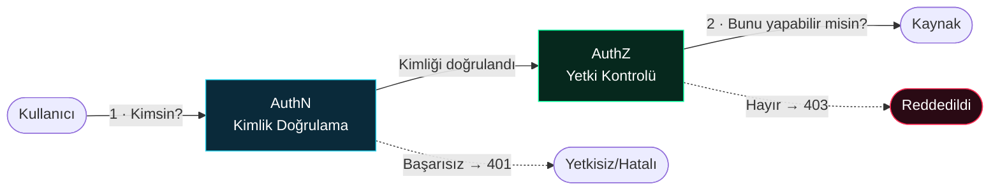
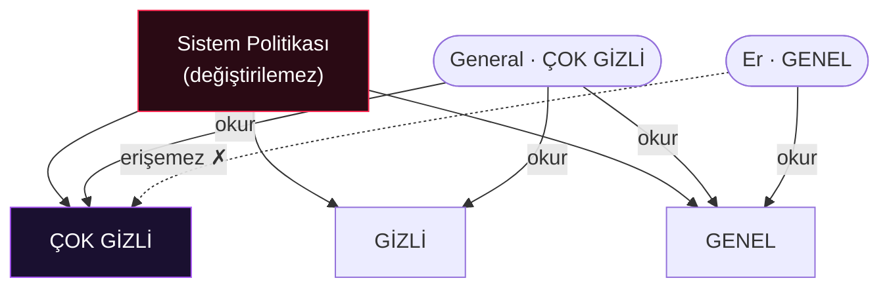
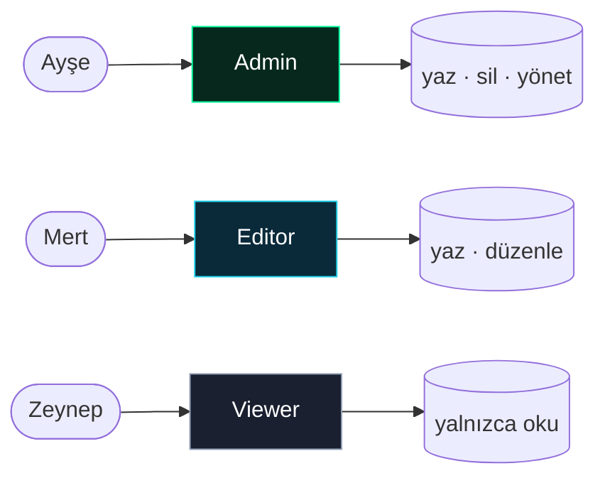
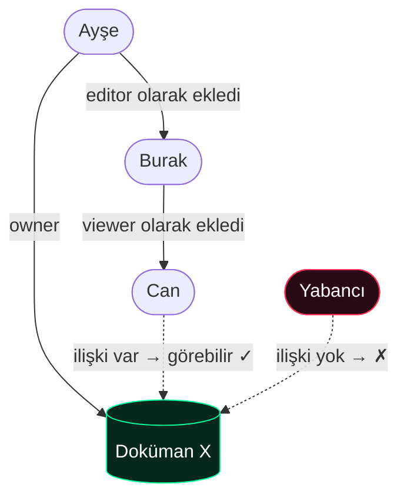
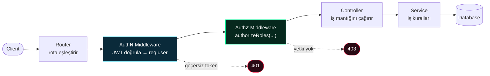

<div class="absolute inset-0 flex flex-col items-center justify-center">


# <span class="glitch">AUTHORIZATION</span>

<div class="text-2xl text-cyan font-mono mt-2 tracking-widest">Y E T K İ L E N D İ R M E</div>

<div class="scanbar my-8 w-2/3 mx-auto" />


<div class="mt-10 flex items-center justify-center gap-3 text-sm text-gray-500 font-mono">
  <span class="i-carbon:circle-solid text-neon text-[8px] animate-ping" />
Bir kod parçası değil — bir mühendisin sistem mimarisinde kurması gereken
<strong>en kritik savunma hattı.</strong>
</div>

</div>


<!--
Hoş geldiniz. Bugün yazılım dünyasının en çok ihmal edilen ama en çok bedel ödeten konusunu konuşacağız: Authorization.
Bu sunum boyunca sadece teoriyi değil, gerçekten yaşanmış, milyarlarca dolarlık olayları da göreceğiz.
-->


---
layout: two-cols
layoutClass: gap-12
transition: slide-up
---

# Gündem

<div class="text-sm text-gray-400 mb-4">Giriş → Problem → Mimari → Gerçek Hayat → Sonuç</div>

<div class="space-y-3 mt-10">
  <div class="flex items-center gap-3">
    <span class="w-8 h-8 flex items-center justify-center rounded bg-cyan/10 text-cyan font-mono text-xs">01</span>
    <span class="font-medium">Temel Kavramlar</span>
  </div>
  <div class="flex items-center gap-3">
    <span class="w-8 h-8 flex items-center justify-center rounded bg-neon/10 text-neon font-mono text-xs">02</span>
    <span class="font-medium">AuthZ Modelleri</span>
  </div>
  <div class="flex items-center gap-3">
    <span class="w-8 h-8 flex items-center justify-center rounded bg-purple/10 text-purple font-mono text-xs">03</span>
    <span class="font-medium">Standartlar & Mimari</span>
  </div>
  <div class="flex items-center gap-3">
    <span class="w-8 h-8 flex items-center justify-center rounded bg-amber/10 text-amber font-mono text-xs">04</span>
    <span class="font-medium">Kod Uygulamaları</span>
  </div>
  <div class="flex items-center gap-3">
    <span class="w-8 h-8 flex items-center justify-center rounded bg-hot/10 text-hot font-mono text-xs">05</span>
    <span class="font-medium">Vaka Analizleri</span>
  </div>
</div>

::right::

<div class="mt-20 space-y-3">

<NeonCard icon="i-carbon:idea" title="Ana mesaj" variant="neon">
Authentication "Sen kimsin?" sorusudur. Authorization "Ne yapabilirsin?" sorusudur — ve <strong>sadece güvenlik için vardır.</strong>
</NeonCard>

<NeonCard icon="i-carbon:warning-alt" title="Neden önemli?" variant="hot">
OWASP Top 10'da <strong>#1</strong> zafiyet: <em>Broken Access Control</em>. Otomatik araçlar bulamaz — çünkü bir <strong>mantık hatasıdır.</strong>
</NeonCard>

</div>

<!--
Bugünkü yolculuğumuz: temel kavramlardan başlayıp, modeller, protokoller, mimari, gerçek kod ve sonunda şirketleri batıran gerçek olaylara gideceğiz.
-->

---
layout: section
class: text-center
---

<div class="chip-cyan mx-auto mb-6">// BÖLÜM 01</div>

# Temel Kavramlar

<div class="text-gray-400 mt-4">Mutlaka bilinmesi gerekenler</div>

<div class="scanbar mt-8 w-1/3 mx-auto" />

---

# Authentication <span class="text-gray-600">vs</span> Authorization

<div class="text-gray-400 -mt-3 mb-6">Çoğu kişi karıştırır. Bir mühendis asla karıştırmaz.</div>

<div grid="~ cols-2 gap-6">

<div >
<NeonCard icon="i-carbon:fingerprint-recognition" title="Authentication (AuthN)" variant="cyan">
<div class="text-lg cyan-text font-bold mb-2">"Sen kimsin?"</div>
Kimliğin doğrulanması. Parola, biyometrik, token…
<div class="mt-3 text-xs text-gray-400">Hem <strong>güvenlik</strong> hem de <strong>kişiselleştirme</strong> için (profil, dil, öneriler).</div>
</NeonCard>
</div>

<div >
<NeonCard icon="i-carbon:rule-locked" title="Authorization (AuthZ)" variant="neon">
<div class="text-lg neon-text font-bold mb-2">"Ne yapabilirsin?"</div>
Yetkinin kontrol edilmesi. Erişim izni var mı?
<div class="mt-3 text-xs text-gray-400">Yalnızca ve yalnızca <strong>güvenlik</strong> içindir. Asla bir "özellik" değildir.</div>
</NeonCard>
</div>

</div>

<div  class="mt-6">



</div>

<!--
Kapı analojisi: AuthN kapıdan içeri kim girdiğini söyler. AuthZ ise o kişinin hangi odalara girebileceğini söyler.
Kritik nokta: AuthZ her zaman AuthN üzerine inşa edilir.
-->

---

# AuthN vs AuthZ — İleri Seviye Bakış

<div class="text-gray-400 -mt-3 mb-6">Klasik tanımı herkes biliyor. Mimari gerçek şu üç kuralda:</div>

<div class="space-y-4">

<div  class="neon-card p-4 flex items-start gap-4">
  <span class="text-3xl font-mono font-extrabold neon-text">1</span>
  <div>
  <strong>AuthN yoksa AuthZ da olamaz.</strong>
  <span class="text-gray-400">Kullanıcının kim olduğunu bilmiyorsan, neye yetkili olduğunu kontrol edemezsin. Anonim sistemin yetki sistemi olmaz.</span>
  </div>
</div>

<div class="cyan-card p-4 flex items-start gap-4">
  <span class="text-3xl font-mono font-extrabold cyan-text">2</span>
  <div>
  <strong>AuthN olan bir sistemin AuthZ'si olmayabilir.</strong>
  <span class="text-gray-400">Bu durumda herkesin rolü ve yetkisi eşittir — bir blog, bir forum gibi.</span>
  </div>
</div>

<div class="danger-card p-4 flex items-start gap-4">
  <span class="text-3xl font-mono font-extrabold hot-text">3</span>
  <div>
  <strong>AuthZ <em>her zaman</em> AuthN üzerine inşa edilir.</strong>
  <span class="text-gray-400">AuthN bir özellik katar (kişisel deneyim). AuthZ özellik katmaz — sadece arka planda korur. İşte bu yüzden <span class="hot-text">unutulur.</span></span>
  </div>
</div>

</div>

<div class="mt-6 text-center text-lg">
<span v-mark.underline.cyan>AuthZ "ekstra bir özellik" değildir; sistemin <strong>zorunlu temelidir.</strong></span>
</div>

<!--
3. madde mühendislik dersidir: Authorization yeni bir buton, yeni bir ekran getirmez. Kullanıcı onu "görmez". Bu yüzden geliştiriciler "sonra ekleriz" der. Ve felaket buradan başlar.
-->

---

# Sözlük: Bilmemiz Gereken 4 Terim

<div class="text-gray-400 -mt-3 mb-8">Tüm yetkilendirme modelleri bu dört kavramın üzerine kurulur.</div>

<div grid="~ cols-2 gap-5">


<NeonCard icon="i-carbon:user-profile" title="Principal" variant="cyan">
Yetki verilen <strong>varlık</strong>. Bir kullanıcı, bir servis, bir sistem… <span class="text-gray-500 font-mono text-xs">→ "kim"</span>
</NeonCard>

<NeonCard icon="i-carbon:data-base" title="Resource" variant="neon">
Erişilmek istenen <strong>kaynak</strong>. Dosya, API, veritabanı satırı… <span class="text-gray-500 font-mono text-xs">→ "ne"</span>
</NeonCard>

<NeonCard icon="i-carbon:checkmark-outline" title="Permission" variant="amber">
<strong>İzin</strong>. Okuma, yazma, silme, çalıştırma… <span class="text-gray-500 font-mono text-xs">→ "hangi eylem"</span>
</NeonCard>

<NeonCard icon="i-carbon:rule" title="Policy" variant="hot">
Yetki kurallarını tanımlayan <strong>kural seti</strong>. <span class="text-gray-500 font-mono text-xs">→ "hangi koşulda"</span>
</NeonCard>


</div>

<div class="mt-6 text-center font-mono text-sm chip-neon mx-auto">
Policy: <span class="cyan-text">Principal</span> → <span class="text-amber">Permission</span> → <span class="neon-text">Resource</span> ?
</div>

---
transition: view-transition
---

# HTTP 401 <span class="text-gray-600">vs</span> 403 — Akılda Kalıcı Fark

<div grid="~ cols-2 gap-6" class="mt-4">

<div >
<div class="cyan-card p-5">
<div class="font-mono text-3xl cyan-text font-extrabold">401</div>
<div class="text-xl font-bold text-white mt-1">Unauthorized</div>
<div class="text-sm text-gray-400 mt-2">İsim yanlış: aslında <strong>"Unauthenticated"</strong> demektir.</div>
<div class="mt-3 text-sm">→ <em>"Seni tanımıyorum. Önce kimliğini kanıtla."</em></div>
<div class="mt-2 font-mono text-xs text-gray-500">AuthN başarısız · Token yok/geçersiz</div>
</div>
</div>

<div >
<div class="danger-card p-5">
<div class="font-mono text-3xl hot-text font-extrabold">403</div>
<div class="text-xl font-bold text-white mt-1">Forbidden</div>
<div class="text-sm text-gray-400 mt-2">Kimliğini biliyorum — ama <strong>yetkin yok.</strong></div>
<div class="mt-3 text-sm">→ <em>"Kim olduğunu biliyorum, ama buraya giremezsin."</em></div>
<div class="mt-2 font-mono text-xs text-gray-500">AuthN başarılı · AuthZ başarısız</div>
</div>
</div>

</div>

<div  class="mt-6">
<Terminal title="curl — 401 vs 403">
<div class="cmd">curl /api/admin            <span class="dim"># token yok</span></div>
<div class="err">HTTP/1.1 401 Unauthorized</div>
<div class="dim">&nbsp;</div>
<div class="cmd">curl /api/admin -H "Authorization: Bearer &lt;ogrenci_token&gt;"</div>
<div class="err">HTTP/1.1 403 Forbidden   <span class="dim"># kimsin biliyorum, ama admin değilsin</span></div>
</Terminal>
</div>

<!--
Kısa hafıza kancası: 401 = "Sen kimsin bilmiyorum" (giriş yap). 403 = "Seni tanıyorum ama yasak". 401 authentication, 403 authorization katmanıdır.
-->

---
layout: section
class: text-center
---

<div class="chip-cyan mx-auto mb-6">// BÖLÜM 02</div>

# Authorization Modelleri

<div class="text-gray-400 mt-4">Sunumun çekirdeği — DAC · MAC · RBAC · ABAC · ReBAC</div>

<div class="scanbar mt-8 w-1/3 mx-auto" />


---

# MAC — Mandatory Access Control

<div grid="~ cols-2 gap-8">

<div>

<div class="chip-hot mb-4">ZORUNLU ERİŞİM KONTROLÜ</div>

- **Sistem politikaları** belirler; kullanıcı **değiştiremez**
- Etiketler & güvenlik seviyeleri (Gizli, Çok Gizli…)

<div  class="mt-5">

**Örnekler**
<div class="flex flex-wrap gap-2 mt-2">
<span class="chip-hot"><span class="i-carbon:security" /> Askerî sistemler</span>
<span class="chip-hot"><span class="i-carbon:logo-linux" /> SELinux</span>
</div>

</div>

<div  class="mt-5 grid grid-cols-2 gap-3 text-sm">
<div class="neon-card p-3"><span class="neon-text">✓ Avantaj</span><br/>Çok yüksek güvenlik</div>
<div class="danger-card p-3"><span class="hot-text">✗ Dezavantaj</span><br/>Katı ve karmaşık</div>
</div>

</div>

<div >



<div class="mt-3 text-xs text-gray-500 text-center">
Er, isteseniz bile "Çok Gizli" belgeyi göremez. Karar kullanıcıda değil, sistemdedir.
</div>

</div>

</div>

---

# RBAC — Role-Based Access Control <span class="chip-neon align-middle">EN YAYGIN</span>

<div grid="~ cols-5 gap-6">

<div class="col-span-2">

- Kullanıcıya **rol** atanır → role göre **izinler**
- Yönetim rol seviyesinde yapılır, kullanıcı tek tek değil

<div  class="mt-4 grid grid-cols-1 gap-2 text-sm">
<div class="neon-card p-3"><span class="neon-text">✓</span> Yönetimi kolay, denetlenebilir</div>
<div class="danger-card p-3"><span class="hot-text">✗</span> <strong>Rol patlaması</strong> (role explosion)</div>
</div>

<div  class="mt-4 chip-cyan">Admin · Editor · Viewer</div>

</div>

<div class="col-span-3" >



</div>

</div>

<div  class="mt-4">

```ts {all|2|4-6}
// Kullanıcı → Rol → İzin
const user = { id: 42, role: 'editor' }

// Kontrol tek satır:
if (!['admin', 'editor'].includes(user.role))
  return res.status(403).send('Forbidden')
```

</div>

<!--
RBAC neden bu kadar yaygın? Çünkü insan zihni "rol" kavramını doğal bulur. İK'da zaten roller var. Ama dikkat: her küçük farklı yetki için yeni rol açarsan, yüzlerce role boğulursun — buna rol patlaması denir.
-->

---

# ABAC — Attribute-Based Access Control

<div grid="~ cols-2 gap-8">

<div>

<div class="chip-cyan mb-4">ÖZNİTELİK TABANLI</div>

Karar; **kullanıcı + kaynak + ortam** özniteliklerine göre **dinamik** verilir.

<div  class="mt-4">

```js {monaco-run} {height:'150px'}
const ctx = {
  user:     { role: 'manager', country: 'TR' },
  resource: { type: 'report', sensitivity: 'high' },
  env:      { time: 14, ip: 'TR' },
}
// Politika: TR'den, mesai saatinde, yönetici
const allow = ctx.user.role === 'manager'
  && ctx.user.country === 'TR'
  && ctx.env.time >= 9 && ctx.env.time <= 18
console.log(allow ? '✅ İZİN' : '⛔ RED')
```

</div>

</div>

<div>

<div >
<NeonCard icon="i-carbon:flow" title="Örnek politika" variant="cyan">
<span class="font-mono text-sm">"Sadece <span class="cyan-text">TR'den</span> giriş yapan, <span class="text-amber">mesai saatindeki</span> <span class="neon-text">yöneticiler</span> erişebilir."</span>
</NeonCard>
</div>

<div  class="mt-4 grid grid-cols-2 gap-3 text-sm">
<div class="neon-card p-3"><span class="neon-text">✓</span> Aşırı esnek, ince ayar</div>
<div class="danger-card p-3"><span class="hot-text">✗</span> Politika yönetimi karmaşık</div>
</div>

<div  class="mt-4 text-sm text-gray-400">
RBAC "kim olduğuna" bakar; ABAC "<strong>hangi koşulda olduğuna</strong>" bakar.
</div>

</div>

</div>

---

# ReBAC — Relationship-Based Access Control

<div grid="~ cols-2 gap-8">

<div>

<div class="chip-neon mb-4">İLİŞKİ TABANLI · MODERN</div>

- Yetki, **varlıklar arası ilişkiden** doğar
- Google **Zanzibar**'ın temeli — milyarlarca kullanıcı

<div  class="mt-4">

> *"Bu dokümanı **paylaşan** kişinin, onu paylaştığı kişiler görebilir."*

</div>

<div  class="mt-4 flex flex-wrap gap-2">
<span class="chip-neon"><span class="i-logos:google-drive" /> Google Drive</span>
<span class="chip-cyan"><span class="i-simple-icons:notion" /> Notion</span>
<span class="chip-cyan"><span class="i-logos:github-icon" /> GitHub</span>
</div>

</div>

<div >



<div class="mt-2 text-xs text-gray-500 text-center">
"user:can <span class="neon-text">viewer</span> document:X" — Zanzibar tuple'ı
</div>

</div>

</div>


---
layout: section
class: text-center
---

<div class="chip-cyan mx-auto mb-6">// BÖLÜM 03</div>

# Protokoller, Standartlar & Mimari

<div class="text-gray-400 mt-4">Tekrar icat etme — endüstri standartlarını kullan</div>

<div class="scanbar mt-8 w-1/3 mx-auto" />

---

# Önemli Protokoller & Standartlar

| Standart | Ne işe yarar? | Örnek kullanım |
|---|---|---|
| <span class="neon-text font-bold">OAuth 2.0</span> | Üçüncü taraf erişim **yetkisi** (delegasyon) | "Google ile giriş yap" |
| <span class="cyan-text font-bold">OpenID Connect</span> | OAuth üzerine **kimlik** katmanı | SSO sistemleri |
| <span class="text-amber font-bold">JWT</span> | Yetki bilgisini taşıyan **token** | API güvenliği |
| <span class="neon-text font-bold">SAML 2.0</span> | Kurumsal SSO (XML tabanlı) | Active Directory |
| <span class="cyan-text font-bold">XACML</span> | ABAC için **politika dili** | Büyük kurumsal sistemler |

<div v-click class="mt-6 danger-card p-4">
<span class="i-carbon:warning-alt hot-text text-xl align-middle" />
<strong class="hot-text">Sık karıştırılan:</strong> OAuth bir <em>authorization</em> protokolüdür (yetki delegasyonu), <em>authentication</em> değil. Kimlik için <strong>OpenID Connect</strong> gelir.
</div>


---

# JWT — Anatomi & Tehlike

<div grid="~ cols-2 gap-6">

<div>

Bir JWT üç parçadan oluşur — nokta ile ayrılır:

```text
header . payload . signature
```

<div>

```json
// payload — base64, ŞİFRELİ DEĞİL!
{
  "sub": "42",
  "role": "student",   // ← yetki bilgisi
  "org": "school-A",
  "exp": 1799999999
}
```

</div>

<div class="mt-3 danger-card p-3 text-sm">
<span class="hot-text font-bold">⚠ Payload şifreli değildir</span>, sadece imzalıdır. İçindeki rolü asla "gizli" sanma — sadece <strong>imza</strong> onu korur.
</div>

</div>

<div>
<Terminal title="jwt — manipülasyon denemesi">
<div class="cmd">echo $PAYLOAD | base64 -d</div>
<div class="out">{"role":"student"}</div>
<div class="dim">&nbsp;</div>
<div class="warn"># saldırgan role'ü 'admin' yapıp</div>
<div class="warn"># yeniden kodluyor...</div>
<div class="cmd">curl /admin -H "Authorization: Bearer $FAKE"</div>
<div class="err">401 — invalid signature ✗</div>
<div class="dim">&nbsp;</div>
<div class="ok"># imza doğrulaması payload'u korudu</div>
<div class="err"># AMA: alg:none kabul edilirse → FELAKET</div>
</Terminal>

<div class="mt-3 text-xs text-gray-500">
Kural: <code>alg:none</code>'ı asla kabul etme, imzayı <strong>her zaman</strong> sunucuda doğrula.
</div>

</div>

</div>


---
layout: center
---

# İki Altın İlke

<div grid="~ cols-2 gap-8" class="mt-6">

<div>
<NeonCard icon="i-carbon:network-4" title="Zero Trust" variant="cyan">
<div class="text-lg cyan-text font-bold my-1">"Kimseye güvenme, her şeyi doğrula."</div>
İç ağ da dahil hiçbir istek baştan güvenilir sayılmaz. Her erişim yeniden kontrol edilir.
<div class="mt-3 text-xs text-gray-500">"Castle & moat" devri bitti — perimeter yok.</div>
</NeonCard>
</div>

<div>
<NeonCard icon="i-carbon:locked" title="Least Privilege" variant="neon">
<div class="text-lg neon-text font-bold my-1">"Sadece gerektiği kadar yetki ver."</div>
Her principal, işini yapmak için gereken <strong>asgari</strong> izne sahip olmalı — fazlası değil.
<div class="mt-3 text-xs text-gray-500">Capital One olayı: aşırı geniş IAM yetkisinin bedeli.</div>
</NeonCard>
</div>

</div>

<div class="mt-8 text-center text-gray-400">
Bu iki ilke, aşağıda göreceğimiz felaketlerin <strong class="neon-text">çoğunu</strong> önlerdi.
</div>

---
layout: section
class: text-center
---

<div class="chip-cyan mx-auto mb-6">// BÖLÜM 04</div>

# Pratik: Kod ile Authorization

<div class="text-gray-400 mt-4">Express.js · MVC · Basitten gelişmişe — 3 aşama</div>

<div class="scanbar mt-8 w-1/3 mx-auto" />

---

# AuthZ Uyumlu Proje Mimarisi (MVC)

<div class="text-gray-400 -mt-3 mb-4">İstek bir <strong>katman zincirinden</strong> geçer. Her katmanın tek bir sorumluluğu vardır.</div>



<div class="mt-5 grid grid-cols-3 gap-3 text-sm">
<div class="cyan-card p-3"><strong>Router</strong> okunabilir kalır — sadece "kim girebilir"i belirtir.</div>
<div class="neon-card p-3"><strong>Middleware</strong> AuthN/AuthZ'yi tek noktada toplar.</div>
<div class="neon-card p-3"><strong>Controller</strong> yalnızca iş mantığına odaklanır.</div>
</div>

---

# Aşama 1 → 2 → 3: Kodun Evrimi

<div class="text-gray-400 -mt-3 mb-3 text-sm">Aynı kontrol; dağınıktan → temiz mimariye. <kbd>Space</kbd> ile ilerleyin.</div>

````md magic-move {lines: true}
```js
// AŞAMA 1 — Monolitik app.js (her endpoint'te elle kontrol)
app.get('/admin', (req, res) => {
  const token = req.headers.authorization?.split(' ')[1]
  const user = jwt.verify(token, SECRET)          // AuthN
  if (user.role !== 'admin')                       // AuthZ
    return res.status(403).send('Forbidden')
  res.send('Admin paneli')
})

app.get('/teachers', (req, res) => {
  const token = req.headers.authorization?.split(' ')[1]
  const user = jwt.verify(token, SECRET)          // TEKRAR
  if (user.role !== 'teacher' && user.role !== 'admin')
    return res.status(403).send('Forbidden')      // KOPYALA-YAPIŞTIR
  res.send('Öğretmen paneli')
})
// ❌ Tekrar, tekrar, tekrar. Bir yeri unutursan → açık.
```

```js
// AŞAMA 2 — Rotaları ayır (routes/adminRoutes.js)
const router = require('express').Router()

// Kimlik doğrulama hâlâ her handler'da tekrarlanıyor
router.get('/', (req, res) => {
  const user = jwt.verify(req.token, SECRET)
  if (user.role !== 'admin')
    return res.status(403).send('Forbidden')
  res.send('Admin paneli')
})

module.exports = router
// app.js → app.use('/admin', adminRoutes)
// ✅ Daha düzenli  ❌ ama yetki mantığı hâlâ dağınık
```

```js
// AŞAMA 3 — Modüler middleware (TEMİZ MİMARİ) ✨
// middleware/auth.js
function authenticate(req, res, next) {        // AuthN
  try {
    const token = req.headers.authorization?.split(' ')[1]
    req.user = jwt.verify(token, SECRET)        // → req.user
    next()
  } catch { return res.status(401).json({ error: 'Unauthorized' }) }
}

function authorizeRoles(...roles) {             // AuthZ (dinamik)
  return (req, res, next) => {
    if (!roles.includes(req.user.role))
      return res.status(403).json({ error: 'Forbidden' })
    next()
  }
}
module.exports = { authenticate, authorizeRoles }
```

```js
// AŞAMA 3 — routes/adminRoutes.js — artık OKUNABİLİR
const { authenticate, authorizeRoles } = require('../middleware/auth')

router.get('/dashboard',
  authenticate,                        // 1) Kimsin?
  authorizeRoles('admin'),             // 2) Yetkin var mı?
  adminController.dashboard            // 3) İş mantığı (sadece bu!)
)

router.get('/students',
  authenticate,
  authorizeRoles('admin', 'teacher'),  // çoklu rol — tek satır
  studentController.list
)
// ✅ DRY  ✅ okunabilir  ✅ controller temiz  ✅ unutma riski yok
```
````

<!--
Bu 3 aşama, gerçek bir geliştiricinin yaşadığı yolculuktur. Başta her şey app.js'te. Sonra büyür, router'lara ayrılır. Olgunlaştığında ise yetki mantığı tek bir yere — middleware'e — toplanır. authorizeRoles gibi yüksek mertebeli bir fonksiyon, kodu hem DRY hem güvenli yapar.
-->

---

# Controller: Sadece İş Mantığı

<div class="text-gray-400 -mt-3 mb-4">Yetki middleware'de halledildi → controller "temiz" kalır.</div>

<div grid="~ cols-2 gap-5">

```js {all|3-4|5-8}
// controllers/studentController.js
exports.list = async (req, res) => {
  // Yetki KONTROLÜ YOK burada — zaten geçti.
  // Sadece iş
  const students = await studentService
    .findByOrg(req.user.org)  
  res.json(students)
}
```

<div>

<NeonCard icon="i-carbon:checkmark-filled" title="Tek sorumluluk" variant="neon">
Controller "yetki" düşünmez. O işi middleware yaptı.
</NeonCard>

<NeonCard icon="i-carbon:data-1" title="Servis & DB katmanı" variant="cyan" class="mt-2">
Service iş kurallarını, repository/DB ise sorguları yönetir. Sorgular daima <code>req.user.org</code> ile filtrelenir.
</NeonCard>


</div>

</div>

---

# Frontend vs Backend Authorization

<div grid="~ cols-2 gap-6">

<div>
<div class="cyan-card p-5 h-full">
<div class="flex items-center gap-2 mb-2"><span class="i-carbon:laptop text-2xl cyan-text" /><span class="text-xl font-bold text-white">Frontend</span></div>
<div class="cyan-text font-semibold">Amaç: Deneyim (UX)</div>
<ul class="text-sm mt-2 space-y-1">
<li>Admin butonunu <strong>gizle</strong></li>
<li>Yetkisiz sayfaya yönlendirme</li>
<li>Gereksiz isteği baştan engelle</li>
</ul>
<div class="mt-3 chip-cyan">Kolaylık · görsellik</div>
</div>
</div>

<div>
<div class="neon-card p-5 h-full">
<div class="flex items-center gap-2 mb-2"><span class="i-carbon:bare-metal-server text-2xl neon-text" /><span class="text-xl font-bold text-white">Backend</span></div>
<div class="neon-text font-semibold">Amaç: GÜVENLİK (gerçek koruma)</div>
<ul class="text-sm mt-2 space-y-1">
<li>Her istekte yetkiyi <strong>doğrula</strong></li>
<li>Token + rol + sahiplik kontrolü</li>
<li>Tek <strong>gerçek</strong> savunma hattı</li>
</ul>
<div class="mt-3 chip-neon">Zorunlu · pazarlıksız</div>
</div>
</div>

</div>

<div class="mt-6 danger-card p-4 text-center text-lg">
<span class="i-carbon:warning-alt-filled hot-text align-middle" />
<strong class="hot-text">Altın kural:</strong> Frontend kontrolü <u>sadece kozmetiktir.</u> Saldırgan butonu görmez — ama isteği <span class="font-mono">curl</span> ile doğrudan atar. <strong>Yetki backend'de yoksa, hiç yoktur.</strong>
</div>

<!--
Frontend'de butonu gizlemek güvenlik değildir. F12 → Network → isteği kopyala → tekrar gönder. Ya da curl. Saldırgan sizin React arayüzünüzü kullanmaz. Gerçek kontrol her zaman sunucudadır.
-->

---
layout: section
class: text-center
---

<div class="chip-cyan mx-auto mb-6">// BÖLÜM 05</div>

# B2B & Çok Katmanlı Yetki

<div class="text-gray-400 mt-4">Rol kontrolü tek başına neden yetmez? — A · B · C senaryosu</div>

<div class="scanbar mt-8 w-1/3 mx-auto" />

---

# Senaryo: Bir Okul Yönetim Sistemi

<div class="text-gray-400 -mt-3 mb-4">Her adımda yeni bir saldırgan çıkıyor. Kontrolümüzü katmanlamalıyız.</div>

<div class="space-y-4">

<div class="neon-card p-4">
<span class="chip-neon">A · ROL KONTROLÜ</span>
<div class="mt-2">Müdür ve öğretmenin yetkilerini ayır → <code>authorizeRoles('manager')</code></div>
<div class="text-sm text-gray-400 mt-1">Tek kurum için yeterli görünüyor. ✓</div>
</div>

<div class="cyan-card p-4">
<span class="chip-cyan">B · ORGANİZASYON KONTROLÜ</span>
<div class="mt-2"><span class="hot-text">Sorun:</span> X kurumunun müdürü, Y kurumuna erişmeyi dener. Rolü "müdür" olduğu için A geçer! → <code>resource.org === req.user.org</code> kontrolü ŞART.</div>
<div class="text-sm text-gray-400 mt-1">B2B / multi-tenant'ın kalbi: <strong>tenant izolasyonu.</strong></div>
</div>

<div class="danger-card p-4">
<span class="chip-hot">C · KAYNAK (SAHİPLİK) KONTROLÜ</span>
<div class="mt-2"><span class="hot-text">Sorun:</span> Bir öğretmen, <em>aynı kurumdaki başka</em> bir öğretmenin öğrencisine erişir. A ✓ B ✓ ama yine de yanlış! → Bu klasik <strong class="hot-text">IDOR</strong> açığıdır. → <code>student.teacherId === req.user.id</code></div>
</div>

</div>

<div class="mt-4 text-center font-mono chip-neon mx-auto">
Güvenli erişim = ROL ∧ ORGANİZASYON ∧ SAHİPLİK
</div>

<!--
Bu, sunumun en önemli mühendislik dersi. Çoğu geliştirici A'da durur. Gerçek sistemlerde A+B+C gerekir. Her katman, bir önceki saldırganı durdurur.
-->

---

# A + B + C Kodda Nasıl Görünür?

<div grid="~ cols-2 gap-6">

```js {all|5-7|9-12|14-17}
// GET /students/:id  → öğrenci detayı
exports.getStudent = async (req, res) => {
  const student = await studentService.findById(req.params.id)

  // A) ROL: öğretmen mi?  (middleware'de geçti)
  if (!['teacher','manager'].includes(req.user.role))
    return res.status(403).json({ e: 'rol yok' })

  // B) ORGANİZASYON: aynı kurum mu?
  if (student.org !== req.user.org)
    return res.status(403).json({ e: 'farklı kurum' })

  // C) SAHİPLİK: bu öğrenci ona mı bağlı?
  if (req.user.role === 'teacher'
      && student.teacherId !== req.user.id)
    return res.status(403).json({ e: 'senin öğrencin değil' })

  res.json(student)   // ✅ üç kapıdan da geçti
}
```

<div>

<div>

<div class="neon-card p-3"><span class="chip-neon">A</span> <span class="text-sm">Rol middleware'i — kabaca filtreler.</span></div>
<div class="cyan-card p-3"><span class="chip-cyan">B</span> <span class="text-sm">Tenant izolasyonu — B2B'nin olmazsa olmazı. Tek satır, devasa koruma.</span></div>
<div class="danger-card p-3"><span class="chip-hot">C</span> <span class="text-sm">Nesne seviyesinde sahiplik (BOLA/IDOR savunması). En çok unutulan, en pahalı katman.</span></div>

<div class="mt-2 text-sm text-gray-400">
İdeal: Bu mantığı <code>can(user, 'read', student)</code> gibi tek bir <strong>policy</strong> fonksiyonunda topla.
</div>

</div>

</div>

</div>

---
layout: section
class: text-center
---

<div class="chip-hot mx-auto mb-6 animate-pulse">// BÖLÜM 06 · TEHLİKE</div>

# Güvenlik Açıkları & Saldırılar

<div class="text-gray-400 mt-4">Authorization yapılmazsa ne olur?</div>

<div class="scanbar mt-8 w-1/3 mx-auto" />

---
layout: center
class: text-center
---

<div class="chip-hot mx-auto mb-6">OWASP TOP 10 · 2021</div>

# <span class="hot-text">#1</span> Broken Access Control

<div class="text-xl text-gray-300 mt-4 max-w-2xl mx-auto">
Erişim Kontrolü İhlali, dünyanın <strong class="hot-text">en yaygın</strong> ve en tehlikeli zafiyetidir.
</div>

<div grid="~ cols-3 gap-5" class="mt-10 max-w-3xl mx-auto">
<div><StatBadge value="#1" label="OWASP Top 10 sıralaması" variant="hot" /></div>
<div><StatBadge value="94%" label="test edilen uygulamada görüldü" variant="amber" /></div>
<div><StatBadge value="318K+" label="kayıtlı zafiyet örneği" variant="cyan" /></div>
</div>

<div class="mt-10 max-w-2xl mx-auto neon-card p-4 text-left">
<span class="i-carbon:idea neon-text" /> <strong>Neden bu kadar yaygın?</strong> Çünkü bir <strong>mantık hatasıdır</strong> (logical flaw). Tarayıcılar, statik analiz araçları bunu kolay bulamaz — kodun "çalışması" açık olmadığı anlamına gelmez.
</div>

---

# IDOR — Insecure Direct Object Reference

<div grid="~ cols-2 gap-6">

<div>

<div class="text-gray-300">
Sunucu "<span class="cyan-text">Ne isteniyor?</span>" sorusuna cevap verir ama "<span class="hot-text">Kim istiyor?</span>" sorusunu <strong>atlar.</strong>
</div>

<div class="mt-4">
> "Yan daireye bakıp çıkacağız" dediğinde, sistemin "Buyur, anahtara gerek yok" demesi ne kadar absürtse, IDOR da o kadar absürt — ama o kadar yaygın.
</div>

<div class="mt-4 text-sm text-gray-400">
Şifre kırmak yok, algoritma yok. Sadece URL'deki <strong>id</strong>'yi değiştir.
</div>

</div>

<div>
<Terminal title="exploit — IDOR (id artırma)">
<div class="cmd">curl site.com/document?id=000000075</div>
<div class="out">→ KENDİ belgem ✓</div>
<div class="dim">&nbsp;</div>
<div class="warn"># peki ya +1 ?</div>
<div class="cmd">curl site.com/document?id=000000076</div>
<div class="err">→ BAŞKASININ banka belgesi 😱</div>
<div class="cmd">for i in {1..885000000}; do ...</div>
<div class="err">→ 885.000.000 belge dökülüyor</div>
</Terminal>
</div>

</div>

<div class="mt-5 neon-card p-4 text-center">
<strong class="neon-text">Çözüm:</strong> Her sorguyu sahiplikle bağla → <code>WHERE id = :id AND owner_id = :currentUser</code>. Ayrıca tahmin edilemez ID (UUID) kullan — ama <u>asıl koruma her zaman sunucu tarafı yetki kontrolüdür.</u>
</div>


---
transition: fade-out
layout: center
class: text-center
---

<div class="chip-hot mx-auto mb-8">// REALITY CHECK</div>

<div class="text-3xl leading-relaxed font-light max-w-3xl mx-auto">
Tek yapması gereken, adres çubuğundaki
<span class="hot-text font-mono font-bold">id=75</span>'i
<span class="neon-text font-mono font-bold">id=76</span> yapmaktı.
</div>

<div v-click>
<div  class="mt-12 text-5xl font-mono font-extrabold hot-text">
885.000.000 belge
</div>
<div  class="text-lg text-gray-400 mt-3">
…tek bir yetki kontrolü unutulduğu için sızdı. <span class="text-gray-600">(First American, 2019)</span>
</div></div>


<!--
Şununla başlayalım: karmaşık bir şifre kırma, sıfırıncı gün açığı değil. Sadece URL'deki bir sayı.
Bu kadar basit bir ihmal, 885 milyon hassas belgeyi açığa çıkardı. İşte Authorization'ın gücü ve eksikliğinin bedeli.
-->


---
layout: section
class: text-center
---

<div class="chip-hot mx-auto mb-6">// BÖLÜM 07 · GERÇEK OLAYLAR</div>

# Bunlar Gerçekten Oldu

<div class="text-gray-400 mt-4">Milyarlarca dolar · milyarlarca kayıt · tek bir unutulan kontrol</div>

<div class="scanbar mt-8 w-1/3 mx-auto" />

<!--
Şimdi teoriyi bırakıp gerçeğe dönüyoruz. Bu olayların her biri, bu sunumda anlattığımız tam olarak bir hatadan kaynaklandı.
-->


---

# <span class="i-carbon:building align-middle" /> First American Financial <span class="chip-hot align-middle">IDOR</span>

<div class="text-gray-400 -mt-2 mb-4 font-mono text-sm">🇺🇸 ABD · 2019 · Emlak & Mülkiyet Sigortası Devi</div>

<div grid="~ cols-2 gap-6">

<div>

<NewsCard source="TechCrunch" date="24 May 2019" headline="First American site bug exposed 885 million sensitive records" accent="#1d9bf0">
URL'deki belge numarasını değiştirerek, oturum açma veya yetki olmadan herkes başkasının ipotek, banka ve SGK belgelerini görüntüleyebiliyordu.
</NewsCard>

<div class="mt-4">
<TweetCard name="Brian Krebs" handle="@briankrebs" color="linear-gradient(135deg,#c00,#900)" verified date="24 May 2019" replies="1.2K" retweets="14K" likes="29K">
First American leaked ~885 MILLION mortgage records going back to 2003. No auth needed — just change the number in the URL. This is about as bad as it gets. 🔓
</TweetCard>
</div>

</div>

<div>

<div class="grid grid-cols-2 gap-3">
<div><StatBadge value="885M" label="sızdırılan belge (2003'e dek)" variant="hot" /></div>
<div><StatBadge value="$1M" label="NYDFS uzlaşması" variant="amber" /></div>
<div><StatBadge value="$487K" label="SEC para cezası" variant="amber" /></div>
<div><StatBadge value="2+ yıl" label="açık kalma süresi" variant="cyan" /></div>
</div>

<div class="mt-4 danger-card p-4 text-sm">
<strong class="hot-text">Kök neden:</strong> Backend "Bu belge gerçekten bu kullanıcının mı?" diye <u>hiç</u> sormadı. Klasik kitap örneği IDOR.
</div>

<div class="mt-3 neon-card p-3 text-sm">
<strong class="neon-text">Ders:</strong> Sahiplik kontrolü (Senaryo C) bir satırla bunu önlerdi.
</div>

</div>

</div>

---

# <span class="i-carbon:phone align-middle" /> Optus <span class="chip-hot align-middle">UNAUTH API</span>

<div class="text-gray-400 -mt-2 mb-4 font-mono text-sm">🇦🇺 Avustralya · Eylül 2022 · 2. En Büyük Telekom</div>

<div grid="~ cols-2 gap-6">

<div>

<NewsCard source="ABC News / Wikipedia" date="22 Sep 2022" headline="Optus data breach exposes data of up to 10 million customers — a third of Australia" accent="#ff2d55">
İnternete açık bırakılan, kimlik doğrulaması <strong>gerektirmeyen</strong> bir API. Saldırgan müşteri ID'lerini sırayla artırarak tüm verileri çekti.
</NewsCard>

<div class="mt-4">
<TweetCard name="Jeremy Kirk" handle="@Jeremy_Kirk" color="linear-gradient(135deg,#16a34a,#22d3ee)" verified date="27 Sep 2022" replies="890" retweets="6.4K" likes="11K">
The Optus API had NO authentication. None. Customer IDs weren't even sequential-secure. You could just iterate and pull everyone's passport & licence numbers. 🤦
</TweetCard>
</div>

</div>

<div>

<div class="grid grid-cols-2 gap-3">
<div><StatBadge value="~10M" label="etkilenen müşteri" variant="hot" /></div>
<div><StatBadge value="%40" label="Avustralya nüfusu" variant="amber" /></div>
<div><StatBadge value="~$95M" label="kriz maliyeti (USD)" variant="amber" /></div>
<div><StatBadge value="3 ay" label="API açık kaldığı süre" variant="cyan" /></div>
</div>

<div class="mt-4 danger-card p-4 text-sm">
<strong class="hot-text">Kök neden:</strong> AuthN bile yoktu → AuthZ imkânsızdı. Pasaport ve ehliyet numaraları herkese açıktı.
</div>

<div class="mt-3 neon-card p-3 text-sm">
<strong class="neon-text">Ders:</strong> "Test endpoint'i" diye internete açık API bırakma. Zero Trust: her endpoint korunur.
</div>

</div>

</div>

---

# <span class="i-carbon:money align-middle" /> Capital One <span class="chip-hot align-middle">SSRF → PRIV ESC</span>

<div class="text-gray-400 -mt-2 mb-4 font-mono text-sm">🇺🇸 ABD · 2019 · Büyük Banka · AWS bulutu</div>

<div grid="~ cols-2 gap-6">

<div>

<NewsCard source="Krebs on Security" date="29 Jul 2019" headline="Capital One: 106M people affected; ex-AWS engineer charged" accent="#22d3ee">
WAF'taki SSRF açığı → AWS metadata servisi → geniş IAM kimlik bilgileri → S3'teki müşteri verisi. Klasik yetki yükseltme zinciri.
</NewsCard>

<div class="mt-4">
<TweetCard name="Capital One" handle="@CapitalOne" color="linear-gradient(135deg,#004977,#d03027)" verified date="29 Jul 2019" replies="8.1K" retweets="5.2K" likes="3.9K">
We've notified federal law enforcement regarding an incident involving unauthorized access to personal information of certain customers. We take our responsibility to protect your information seriously.
</TweetCard>
</div>

</div>

<div>

<div class="grid grid-cols-2 gap-3">
<div><StatBadge value="106M" label="müşteri (ABD + Kanada)" variant="hot" /></div>
<div><StatBadge value="$80M" label="OCC para cezası" variant="amber" /></div>
<div><StatBadge value="$190M" label="toplu dava uzlaşması" variant="amber" /></div>
<div><StatBadge value="$300M+" label="tahmini toplam maliyet" variant="hot" /></div>
</div>

<div class="mt-4 danger-card p-4 text-sm">
<strong class="hot-text">Kök neden:</strong> Aşırı geniş IAM rolü (<em>least privilege ihlali</em>) + SSRF = confused deputy. Sunucu, saldırgan adına kendi yetkisini "ödünç verdi".
</div>

<div class="mt-3 neon-card p-3 text-sm">
<strong class="neon-text">Ders:</strong> En az yetki ilkesi. Servis sadece ihtiyacı olan S3'e erişebilseydi, hasar minimal olurdu.
</div>

</div>

</div>

---

# <span class="i-logos:facebook align-middle" /> Facebook <span class="chip-hot align-middle">TOKEN THEFT</span>

<div class="text-gray-400 -mt-2 mb-4 font-mono text-sm">🇺🇸 ABD · 2018 · "View As" özelliği</div>

<div grid="~ cols-2 gap-6">

<div>

<NewsCard source="NPR" date="28 Sep 2018" headline="Facebook Says Security Breach Affected Almost 50 Million Accounts" accent="#1d9bf0">
"View As" (Farklı Gör) özelliğindeki hata, saldırganların başkalarına ait <strong>erişim token'larını</strong> çıkarmasına izin verdi — yani hesapların tam kontrolü.
</NewsCard>

<div class="mt-4">
<TweetCard name="Guy Rosen" handle="@guyro" color="linear-gradient(135deg,#1877f2,#0a4db3)" verified date="28 Sep 2018" replies="2.3K" retweets="4.1K" likes="6.8K">
We discovered a vulnerability in "View As" that let attackers steal access tokens. We've reset tokens for ~90M accounts as a precaution. Security is an arms race and we're continuing to investigate.
</TweetCard>
</div>

</div>

<div>

<div class="grid grid-cols-2 gap-3">
<div><StatBadge value="50M" label="ele geçirilen hesap" variant="hot" /></div>
<div><StatBadge value="90M" label="zorla çıkış yaptırılan" variant="amber" /></div>
<div><StatBadge value="~$13B" label="saatler içinde piyasa değeri kaybı" variant="hot" /></div>
<div><StatBadge value="$5B" label="sonraki FTC cezası" variant="amber" /></div>
</div>

<div class="mt-4 danger-card p-4 text-sm">
<strong class="hot-text">Kök neden:</strong> Bir özelliğin (video yükleme) başka bir özellikle (View As) etkileşimi, access token sızıntısına yol açtı. Token = "yetkiliyim" kanıtı.
</div>

<div class="mt-3 neon-card p-3 text-sm">
<strong class="neon-text">Ders:</strong> Token'lar en hassas yetki varlığıdır. Kapsam (scope) + kısa ömür + sıkı doğrulama şart.
</div>

</div>

</div>


---
layout: center
class: text-center
---

# Toplam Bilanço

<div class="text-gray-400 mb-8">Yetkilendirme açıklarının yalnızca birkaç olaydaki bedeli:</div>

<div grid="~ cols-4 gap-5" class="max-w-4xl mx-auto">
<div ><StatBadge value="1.1B+" label="sızdırılan kayıt/belge" variant="hot" /></div>
<div ><StatBadge value="$6B+" label="doğrudan ceza + uzlaşma + kayıp" variant="amber" /></div>
<div ><StatBadge value="5+" label="dünya devi şirket" variant="cyan" /></div>
<div ><StatBadge value="1" label="ortak kök neden: AuthZ" variant="neon" /></div>
</div>

<div class="mt-12 max-w-2xl mx-auto text-xl">
En büyük maliyet cezalar değil; <strong class="hot-text">müşteri güveninin</strong> ve <strong class="hot-text">itibarın</strong> çöküşüdür. Parler bu yüzden tamamen yok oldu.
</div>

<div class="mt-6 chip-neon mx-auto text-base">
Bu bedellerin tamamı, <strong>kodda birkaç satırlık</strong> doğru yetki kontrolüyle önlenebilirdi.
</div>

---
layout: section
class: text-center
---

<div class="chip-neon mx-auto mb-6">// BÖLÜM 08 · KORUNMA</div>

# Best Practices & Modern Trendler

<div class="text-gray-400 mt-4">Staj veya ilk projende doğrudan kullanabileceğin kurallar</div>

<div class="scanbar mt-8 w-1/3 mx-auto" />

---

# Mühendislik Checklist'i ✅

<div grid="~ cols-2 gap-4" class="mt-4">

<div class="space-y-2">
  <div class="neon-card p-3 flex gap-3 items-start"><span class="i-carbon:checkmark-filled neon-text mt-1" /><div><strong>Backend'de doğrula.</strong> Frontend kontrolü sadece UX'tir.</div></div>
  <div class="neon-card p-3 flex gap-3 items-start"><span class="i-carbon:checkmark-filled neon-text mt-1" /><div><strong>Deny by default.</strong> Açıkça izin verilmeyen her şey yasaktır.</div></div>
  <div class="neon-card p-3 flex gap-3 items-start"><span class="i-carbon:checkmark-filled neon-text mt-1" /><div><strong>Sahiplik kontrol et.</strong> Sorguyu daima <code>req.user</code> ile sınırla (IDOR).</div></div>
  <div class="neon-card p-3 flex gap-3 items-start"><span class="i-carbon:checkmark-filled neon-text mt-1" /><div><strong>Least privilege.</strong> En az yetki — hem kullanıcı hem servis.</div></div>
</div>

<div class="space-y-2">
  <div class="neon-card p-3 flex gap-3 items-start"><span class="i-carbon:checkmark-filled neon-text mt-1" /><div><strong>Tenant izolasyonu.</strong> B2B'de <code>org</code> kontrolünü asla atlama.</div></div>
  <div class="neon-card p-3 flex gap-3 items-start"><span class="i-carbon:checkmark-filled neon-text mt-1" /><div><strong>Merkezileştir.</strong> Yetki mantığı tek yerde (middleware/policy).</div></div>
  <div class="neon-card p-3 flex gap-3 items-start"><span class="i-carbon:checkmark-filled neon-text mt-1" /><div><strong>Token'ları sıkılaştır.</strong> Kısa exp, imza doğrula, <code>alg:none</code> yasak.</div></div>
  <div class="neon-card p-3 flex gap-3 items-start"><span class="i-carbon:checkmark-filled neon-text mt-1" /><div><strong>Logla & denetle.</strong> Her yetki reddini izle (anomali tespiti).</div></div>
</div>

</div>


---
layout: center
class: text-center
---

# Özet: 5 Cümlede Authorization

<div class="max-w-3xl mx-auto mt-6 space-y-3 text-left">

<div class="neon-card p-3"><span class="font-mono neon-text">01</span> &nbsp; AuthN "kimsin", AuthZ "ne yapabilirsin" — ve AuthZ <strong>her zaman</strong> AuthN üzerine kurulur.</div>

<div class="cyan-card p-3"><span class="font-mono cyan-text">02</span> &nbsp; AuthZ bir özellik değil, sistemin <strong>zorunlu temelidir</strong> — bu yüzden unutulur, bu yüzden tehlikelidir.</div>

<div  class="neon-card p-3"><span class="font-mono neon-text">03</span> &nbsp; Model seç (çoğunlukla <strong>RBAC + ABAC</strong>), ama her zaman <strong>rol ∧ org ∧ sahiplik</strong> kontrol et.</div>

<div  class="cyan-card p-3"><span class="font-mono cyan-text">04</span> &nbsp; Gerçek kontrol <strong>backend'dedir</strong>; deny-by-default ve least-privilege uygula.</div>

<div class="danger-card p-3"><span class="font-mono hot-text">05</span> &nbsp; Tek bir unutulan kontrol = <strong class="hot-text">885M belge, milyarlarca dolar.</strong> Sen yapma.</div>

</div>

---
layout: center
class: text-center
---

<div class="chip-neon mx-auto mb-6">// END OF TRANSMISSION</div>

# <span class="glitch">Teşekkürler</span>

<div class="text-xl text-cyan mt-4 font-light">Sorular & Tartışma</div>

<div class="scanbar my-8 w-1/2 mx-auto" />

<div class="text-gray-400 max-w-xl mx-auto">
Authorization, kullanıcının <strong>görmediği</strong> ama varlığını borçlu olduğu katmandır.<br/>
Bir mühendis olarak, görünmeyeni inşa et.
</div>

<div class="mt-10 flex items-center justify-center gap-6 text-3xl text-gray-500">
<span class="i-carbon:locked hover:text-neon transition" />
<span class="i-carbon:security hover:text-cyan transition" />
<span class="i-carbon:user-admin hover:text-amber transition" />
</div>


<!--
Bitirirken: Authorization'ı bir "sonra ekleriz" işi olarak görmeyin. İlk satırdan itibaren mimarinizin parçası olsun. Sorularınızı alalım.
-->

<style>
  /* Target the dialog ONLY when it contains the hidden "-top-20" class */
  :global(#slidev-goto-dialog[class*="-top-20"]) {
    overflow: hidden !important;
    max-height: 80px !important;
    pointer-events: none !important;
  }
</style>